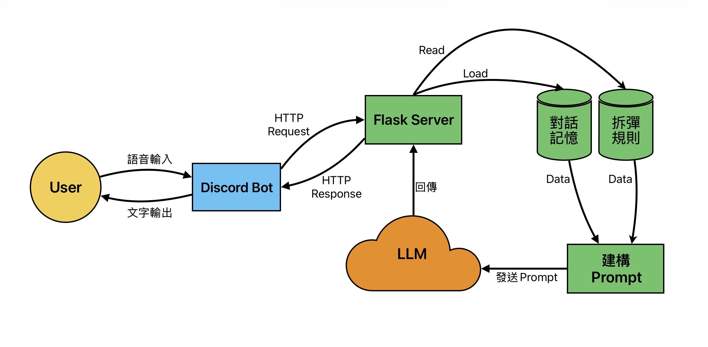

#  蹦蹦炸彈

這是一個基於 **Discord** 的 AI 拆彈助手，專為遊戲《Keep Talking and Nobody Explodes》設計。
透過語音識別 (STT) 與檢索增強生成 (RAG) 技術，能夠聆聽語音描述，自動檢索拆彈手冊規則，並透過 LLM 提供拆彈指令。



##  環境需求

* **Python**: 建議 **3.10 ~ 3.12** ( 注意：Python 3.13+ 已移除 `audioop`，將導致語音功能無法運作)
* **FFmpeg**: 語音處理必要元件 (需安裝並加入系統環境變數 PATH)
* **Discord Bot Token**: 需至 [Discord Developer Portal](https://discord.com/developers/applications) 申請

##  快速啟動 (Quick Start)

### 1. 安裝套件

請確保已進入專案目錄，並執行以下指令安裝依賴：
```bash
pip install -r requirements.txt
```

### 2. 設定參數

請將 `config.example.json` 複製一份並重新命名為 `config.json`，填入您的資訊：
```json
{
    "token": "YOUR_DISCORD_BOT_TOKEN",
    "llmurl": "https://api-gateway.netdb.csie.ncku.edu.tw",
    "apikey": "YOUR_API_KEY",
    "model": "gpt-oss:20b",
    "prefix": "!"
}
```

### 3. 執行系統

使用一鍵啟動腳本同時開啟 Server 與 Bot：
```bash
python start_all.py
```

當看到以下訊息時，代表系統已就緒：
```
[系統] 正在啟動 LLM Server...
[系統] 正在啟動 Discord Bot...
```

## 📂 專案結構

* **bot.py**: Discord 機器人主程式 (處理語音接收/STT)。
* **llm_server.py**: Flask 後端伺服器 (處理對話記憶與 API 轉發)。
* **bomb_core.py**: 核心邏輯 (負責 RAG 規則檢索與 Prompt 建構)。
* **rules.json**: 結構化的拆彈手冊資料庫。
* **start_all.py**: 系統整合啟動腳本。
